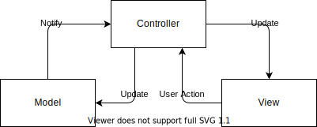
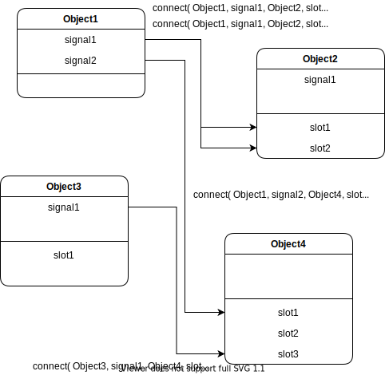

# 复杂软件开发指北

* 分析需求
* **架构设计**
* **接口设计**
* 编写测试
* 实现功能
* 构建程序
* 发布/部署……

## 架构设计

### 工具链/开发框架

根据需求目标和人员实际情况选择：

* 目标平台：PC、服务器、跨平台？
* 语言：本地语言、国际化？
* 程序界面：命令行、图形界面？
* 发布方式：安装包、压缩包、Web 应用？
* 版本控制：分布式、集中式？
* 测试驱动？
* CI/CD?

例子：

* Qt：
  * 周边：Qt Quick, QMake, Qt Creator, Qt Designer, Qt Linguist, QTest, Qt Installer Framework, etc.
  * 跨平台、可视化界面设计、国际化、依赖笨重……
* .NET Framework：
  * 周边：Visual Studio, Winforms, WPF, MSBuild, NuGet, VSTest, etc.
  * 仅Windows、原生体验、可视化界面设计……

### 模块划分

不同层面：子项目、文件/程序集、类/结构、函数/方法/属性

划分的原则：

* 根据功能划分？
  * 单一职责
* 按层次划分？
* 代码复用
* <del>"计算机科学领域的任何问题都可以通过增加一个间接的中间层来解决"</del>
* 易变性优先于功能划分
  * 避免一个需求变化就要改变大量模块
  * 避免每个需求变化都导致某个模块大量改动
* 公共模块应该稳定：
  * 依赖的方向：“不稳定”依赖“稳定”
  * 避免捆绑
* 避免超级繁忙的顶层模块
* 通过新增模块来扩展功能
  * 控制反转 

例子：

* 前端-后端
* MVC 
* 插件系统

## 接口设计（模块耦合）

* 单一职责
* 接口表明设计意图
* 松耦合
  * 不要返回值：信号-槽 / 事件-委托 

## 实际的情况

* 需求分析困难
* 需求粒度经常变化——模块粒度难以把握
* 人员协调困难
* **没有银弹**

# 参考资料

1. [如何复用一套代码满足多样化的需求？](https://github.com/taowen/modularization-examples)
2. [Qt: Signals & Slots](https://doc.qt.io/qt-5/signalsandslots.html)

